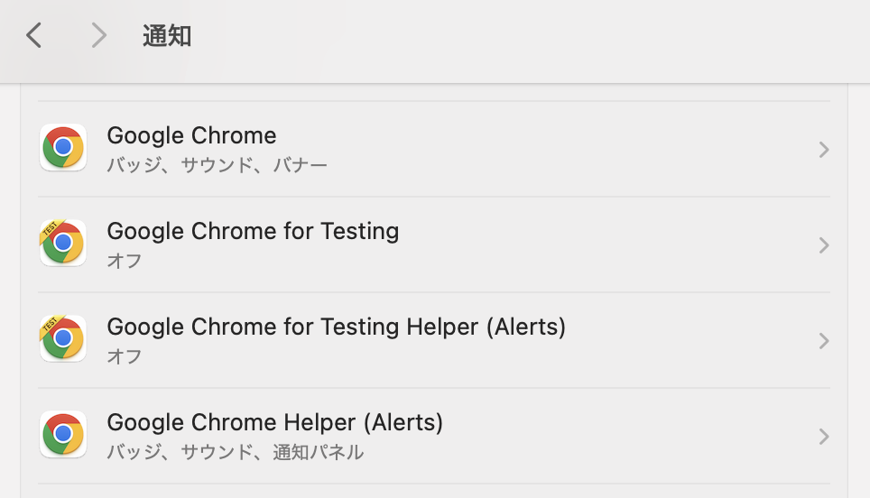

# Owattayo

> [!NOTE]
> 「[Claude Codeをなるべく安全に動かすためのDev Containerを構築した](https://zenn.dev/backpaper0/articles/038838c4cec2a8)」からこのリポジトリを訪れた方へ。
> 記事を書いてからも開発を進めているため、本リポジトリの内容は記事の内容と乖離していると思います。
> 記事執筆時点の本リポジトリがどのような状態だったか見たい場合は[`v1`タグ](https://github.com/backpaper0/owattayo/tree/v1)をご覧ください。

Claude Codeの作業完了を通知するFastAPIアプリケーションです。Discordウェブフックとブラウザ通知（Server-Sent Events）の両方をサポートし、タイトル・メッセージ・URLを含む柔軟な通知システムを提供します。

## 機能

- **デュアル通知システム**
  - Discordウェブフック通知（オプション）
  - Server-Sent Eventsによるリアルタイムブラウザ通知
  - 通知の永続化（`requireInteraction: true`でクリックするまで表示継続）
- **柔軟な通知フォーマット**
  - タイトル・本文・URLを個別設定可能
  - URL付き通知でクリック時にページを自動オープン
- **日本語Webインターフェース**
  - リアルタイム接続状態監視
  - ブラウザ通知の許可管理
  - 通知ログの表示
  - モダンなグラデーションデザイン

## セットアップ

### 必要な環境
- Python 3.12+
- uv（パッケージマネージャー）

### インストール

```bash
# 依存関係のインストール
uv sync

# 仮想環境をアクティブ化（必要に応じて）
source .venv/bin/activate
```

### 環境変数設定

`.env`ファイルを作成して以下の設定を行います：

```bash
# Discordウェブフック通知（オプション）
DISCORD_WEBHOOK_URL=https://discord.com/api/webhooks/your-webhook-url

# デフォルト通知タイトル
DEFAULT_TITLE=Notification
```

### 設定項目

- `DISCORD_WEBHOOK_URL`: Discord通知用ウェブフックURL（未設定の場合はDiscord通知無効）
- `DEFAULT_TITLE`: 通知にタイトルが指定されなかった場合のデフォルトタイトル（デフォルト: "Notification"）

## 実行方法

### 開発サーバー

```bash
# 自動リロード付きで開発サーバーを起動
uv run fastapi dev
```

### Docker

```bash
# イメージをビルド
docker build -t owattayo .

# コンテナを実行
docker run -p 8000:8000 owattayo
```

アプリケーションは http://localhost:8000 でアクセス可能です。

## API仕様

### エンドポイント

| エンドポイント | メソッド | 説明 |
|---|---|---|
| `/notify` | POST | 通知の送信 |
| `/notifications` | GET | Server-Sent Eventsストリーム |
| `/` | GET | 日本語Webインターフェース |

### リクエスト形式

```json
{
  "title": "通知タイトル",
  "body": "通知本文（オプション）",
  "url": "https://example.com（オプション）"
}
```

### 使用例

```bash
# 基本的な通知（デフォルトタイトルを使用）
curl -X POST http://localhost:8000/notify

# カスタムタイトルでの通知
curl -X POST http://localhost:8000/notify \
  -H "Content-Type: application/json" \
  -d '{"title": "Claude Code 作業完了", "body": "プロジェクトの実装が完了しました"}'

# URL付き通知（クリック時にページを開く）
curl -X POST http://localhost:8000/notify \
  -H "Content-Type: application/json" \
  -d '{"title": "PR作成完了", "body": "レビューをお願いします", "url": "https://github.com/user/repo/pull/123"}'
```

## Claude Code連携

### Hookシステム設定

Claude Codeの設定ファイルに以下を追加：

```json
{
  "hooks": {
    "Stop": [
      {
        "matcher": "",
        "hooks": [
          {
            "type": "command",
            "command": "jq -r '.transcript_path' | xargs -I{} cat {} | jq -c 'select(.type == \"user\" and (has(\"toolUseResult\") | not)) | { body: .message.content }' | tail -n 1 | jq -c --arg title \"${NOTIFICATION_TITLE}\" '. + { title: $title }' | curl --connect-timeout 5 -X POST \"${NOTIFICATION_ENDPOINT}\" -H 'Content-Type: application/json' -d @-"
          }
        ]
      }
    ]
  }
}
```

### 動作の流れ

1. Claude Codeでタスクが完了
2. Stopフックが自動実行
3. 通知データがPOST `/notify`に送信
4. Discord・ブラウザに通知配信
5. URLが含まれている場合、通知クリック時に新しいタブでページを開く

## アーキテクチャ

### コア要素

- **Settings Management**: `.env`ファイルによる設定管理（`discord_webhook_url`、`default_title`）
- **Notification System**: シンプルな通知処理（title、body、URL）
- **Notification Manager**: SSEクライアント管理・ブロードキャスト・URL転送
- **API Endpoints**: REST API・SSEストリーム・静的ファイル配信
- **Web Interface**: 日本語UI・リアルタイム通知表示・URL自動オープン機能・モダンデザイン

### ファイル構成

```
/
├── main.py              # 単一ファイルFastAPIアプリケーション
├── pyproject.toml       # プロジェクト設定・依存関係
├── uv.lock             # 依存関係ロックファイル
├── Dockerfile          # コンテナ設定
├── CLAUDE.md           # Claude Code向け開発ガイド
├── static/
│   ├── index.html      # 日本語Webインターフェース
│   └── favicon.svg     # ファビコン
└── .devcontainer/      # VS Code Dev Container設定
    ├── devcontainer.json
    └── compose.yaml
```

## 通知の永続化

ブラウザ通知は`requireInteraction: true`が設定されており、ユーザーがクリックするまで自動的に消えることなく表示され続けます。これにより重要な通知を見逃すリスクを軽減できます。

## トラブルシュート

### Macで通知が表示されない場合

システム設定 → 通知 → Google ChromeおよびGoogle Chrome Helper (Alerts)を許可する。


